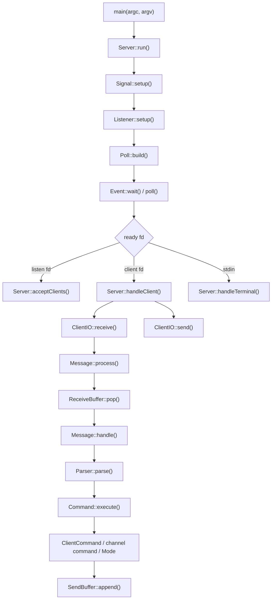

# IRC 서버 모듈 가이드

이 문서는 현재 수정된 코드 기준으로 모듈 경계, 실행 흐름, 각 모듈의 책임, 테스트 방법을 정리한 문서다.

## 근거 자료

| 주제 | 링크 |
|---|---|
| IRC 메시지 형식, `CR-LF` 종료 규칙 | [RFC 1459 - 2.3 Messages](https://www.rfc-editor.org/rfc/rfc1459) |
| IRC 명령 목록과 의미 | [RFC 1459 - 4 Message details](https://www.rfc-editor.org/rfc/rfc1459) |
| `socket()` | [Linux man page - socket(2)](https://man7.org/linux/man-pages/man2/socket.2.html) |
| `poll()` | [Linux man page - poll(2)](https://man7.org/linux/man-pages/man2/poll.2.html) |
| `recv()` | [Linux man page - recv(2)](https://man7.org/linux/man-pages/man2/recv.2.html) |
| `send()` | [Linux man page - send(2)](https://man7.org/linux/man-pages/man2/send.2.html) |

## 전체 구조

```text
main
 -> server
    -> Server
    -> Listener
    -> Poll
    -> ClientIO
    -> Signal
 -> client
    -> Client
    -> ClientManager
    -> ReceiveBuffer
    -> SendBuffer
 -> parser
    -> Parser
 -> serverMessage
    -> Message
 -> serverCommand
    -> Command
    -> serverClientCommand
       -> ClientCommand
    -> serverChannelCommand
       -> CommandHelper
       -> command
          -> Join
          -> Part
          -> Privmsg
          -> Names
          -> Who
          -> Topic
          -> Invite
          -> Kick
       -> mode
          -> Mode
          -> ModeChecker
          -> ModeParser
          -> ModeApplier
          -> ModeChange
 -> channel
    -> ChannelManager
    -> Channel
    -> MemberList
    -> OperatorList
    -> InviteList
    -> ModeState
```

## 모듈 책임 요약

| 모듈 | 책임 |
|---|---|
| `main` | 실행 인자 검사, port/password 검증, `Server` 시작 |
| `server` | listen socket 준비, `poll()` loop, client accept, recv/send, terminal 입력 처리 |
| `client` | 연결된 client 한 명의 상태와 receive/send buffer 저장 |
| `parser` | 한 줄 IRC message를 command type과 params로 변환 |
| `serverMessage` | client receive buffer에서 line을 꺼내고, `Parser`와 `Command` 흐름으로 연결 |
| `serverCommand` | `PASS`, `JOIN`, `MODE` 같은 실제 IRC 명령 실행 |
| `channel` | channel 상태, member/operator/invite/mode/topic 관리 |
| `event` | `poll()` 호출과 system error 출력 |

## 전체 실행 흐름



핵심 흐름은 아래처럼 보면 된다.

```text
TCP bytes
 -> ClientIO::receive()
 -> ReceiveBuffer
 -> Message::process()
 -> ReceiveBuffer::pop()
 -> Message::handle()
 -> Parser::parse()
 -> Command::execute()
 -> ClientCommand / channel command / Mode
 -> SendBuffer
 -> ClientIO::send()
```

## `main` 모듈

### 파일

| 파일 | 역할 |
|---|---|
| `srcs/main.cpp` | 실행 인자 검사, port/password 검증, `Server` 생성 |

### 책임

`main`은 서버 기능을 직접 처리하지 않는다. 실행 전에 port와 password가 쓸 수 있는 값인지 검사하고, 문제가 없으면 `Server`를 만든다.

```text
argv 검사
 -> port 변환
 -> password 검사
 -> Server server(port, password)
 -> server.run()
```

## `server` 모듈

### 파일

| 파일 | 역할 |
|---|---|
| `Server.hpp/cpp` | 서버 전체 흐름 조립, poll 결과 분기, receive buffer message 처리 |
| `Listener.hpp/cpp` | listen socket 생성, option 설정, bind/listen, accept |
| `Poll.hpp/cpp` | `pollfd` 목록 구성 |
| `ClientIO.hpp/cpp` | client socket `recv()` / `send()` / 제거 |
| `Signal.hpp/cpp` | `SIGINT`, `SIGQUIT` 종료 요청 처리 |

### `Server`

`Server`는 네트워크 흐름의 중심이다. IRC 명령 자체를 실행하지 않는다.

| 멤버 | 의미 |
|---|---|
| `_password` | 서버 password. `Message` 생성 시 넘긴다 |
| `_channels` | 전체 channel 목록 |
| `_listener` | listen socket 담당 |
| `_clients` | 연결된 client 목록 |
| `_poll` | poll 대상 fd 목록 생성 |
| `_clientIO` | client fd의 receive/send 담당 |
| `_message` | line을 parser와 command 실행 흐름으로 넘기는 입구 |
| `_event` | `poll()` 호출 |
| `_signal` | 종료 signal 상태 |

`Server::run()` 흐름:

```text
Signal::setup()
 -> Listener::setup()
 -> while (!shouldStop)
    -> Poll::build()
    -> Event::wait()
    -> Server::handlePoll()
```

`Server::handlePoll()`는 fd 종류별로 나눈다.

| fd 종류 | 처리 |
|---|---|
| server terminal `STDIN_FILENO` | `DIE` 입력 확인 |
| listen socket fd | 새 client accept |
| client fd | `POLLIN`, `POLLOUT`, error 처리 |

`Message::process()`는 client receive buffer에서 `\r\n` 기준으로 line을 꺼낸다.

```text
while (client.receiveBuffer().pop(line))
    handle(client, line)
```

즉, `Server`는 client bytes를 receive buffer에 넣은 뒤 `Message`에 message 처리를 맡긴다. line 추출, parser 호출, command 실행 연결은 `serverMessage`가 담당한다.

### `Listener`

`Listener::setup()` 흐름:

```text
socket()
 -> setsockopt(SO_REUSEADDR)
 -> fcntl(O_NONBLOCK)
 -> bind()
 -> listen()
```

`acceptClient()`는 새 client fd를 만든 뒤, 그 fd도 non-blocking으로 바꾼다.

### `Poll`

`Poll::build()`는 매 loop마다 poll 대상 목록을 다시 만든다.

| 대상 | event |
|---|---|
| terminal stdin | `POLLIN` |
| listen socket fd | `POLLIN` |
| client fd | 기본 `POLLIN`, send buffer가 있으면 `POLLOUT` 추가 |

### `ClientIO`

`receive()`는 kernel socket receive buffer에서 bytes를 읽어서 `ReceiveBuffer`에 붙인다.

```text
kernel socket receive buffer
 -> recv()
 -> char buffer[512]
 -> ReceiveBuffer::append()
```

`recv()` 결과별 처리:

| 결과 | 의미 | 처리 |
|---|---|---|
| `> 0` | bytes 읽음 | receive buffer에 저장 |
| `0` | 상대가 연결 종료 | client 제거 |
| `-1`, `EINTR` | signal 때문에 끊김 | 다시 시도 |
| `-1`, `EAGAIN/EWOULDBLOCK` | 지금 더 읽을 데이터 없음 | 정상 종료 |
| 그 외 | socket error | client 제거 |

`send()`는 `SendBuffer`에 쌓인 bytes를 kernel socket send buffer로 넘긴다.

```text
SendBuffer
 -> send()
 -> kernel socket send buffer
 -> TCP로 client에게 전송
```

partial send가 가능하므로 실제로 보낸 byte 수만큼만 send buffer에서 제거한다.

## `client` 모듈

### 파일

| 파일 | 역할 |
|---|---|
| `Client.hpp/cpp` | client fd, 등록 상태, nickname/user/realname, receive/send buffer 소유 |
| `ClientManager.hpp/cpp` | client 생성, 삭제, fd/nickname 검색 |
| `ReceiveBuffer.hpp/cpp` | `recv()`로 받은 raw bytes 저장, `\r\n` 기준 line 추출 |
| `SendBuffer.hpp/cpp` | 나중에 `send()`할 bytes 저장 |

### `Client`

`Client`는 연결된 client 한 명의 상태 저장소다.

| 멤버 | 의미 |
|---|---|
| `_fd` | client socket fd |
| `_hasPassword` | `PASS` 성공 여부 |
| `_registered` | `PASS + NICK + USER` 완료 여부 |
| `_nickname` | IRC nickname |
| `_username` | IRC username |
| `_realname` | IRC realname |
| `_receive` | 받은 raw bytes |
| `_send` | 보낼 bytes |

중요한 점:

```text
Client는 IRC command 의미를 모른다.
Client는 JOIN/MODE/PRIVMSG를 실행하지 않는다.
Client는 자기 상태와 buffer만 가진다.
```

### `ReceiveBuffer`

| 함수 | 역할 |
|---|---|
| `append()` | `recv()`로 받은 bytes를 뒤에 붙임 |
| `pop()` | `\r\n` 기준으로 line 하나 꺼냄 |
| `remove()` | 앞쪽 bytes 제거 |
| `data()` | 현재 raw buffer 확인 |

IRC message는 `CR-LF`, 즉 `\r\n`으로 끝난다. 그래서 `pop()`도 `\r\n`을 기준으로 line을 꺼낸다.

### `SendBuffer`

| 함수 | 역할 |
|---|---|
| `append()` | 보낼 message 저장 |
| `hasData()` | 보낼 데이터가 있는지 확인 |
| `data()` | `send()`에 넘길 pointer 반환 |
| `size()` | 보낼 byte 수 반환 |
| `remove()` | 이미 보낸 bytes 제거 |

## `parser` 모듈

### 파일

| 파일 | 역할 |
|---|---|
| `Parser.hpp/cpp` | line을 command name, params, type으로 파싱 |

### `Parser`

현재 `Parser`는 receive buffer에서 line을 꺼내지 않는다. line 추출은 `ReceiveBuffer::pop()`이 한다.

`Parser`의 책임은 한 줄 문자열을 아래 값으로 바꾸는 것이다.

| 멤버 | 의미 |
|---|---|
| `_name` | 대문자로 정규화된 command 이름 |
| `_params` | command parameter 목록 |
| `_type` | `Parser::Type` enum |

지원 type:

```text
UNKNOWN, CAP, PING, PONG, QUIT,
PASS, NICK, USER,
JOIN, PART, PRIVMSG, NAMES, WHO, TOPIC,
INVITE, KICK, MODE
```

파싱 예시:

```text
입력 line:
PRIVMSG bob :hello bob

Parser 결과:
name   = PRIVMSG
type   = Parser::PRIVMSG
params = ["bob", "hello bob"]
```

`:`로 시작하는 trailing parameter는 뒤쪽 공백까지 하나의 parameter로 본다.

```text
TOPIC #test :hello world
 -> params = ["#test", "hello world"]
```

command name은 대문자로 바꾼다.

| 입력 | 내부 name |
|---|---|
| `join` | `JOIN` |
| `Join` | `JOIN` |
| `JOIN` | `JOIN` |

## `serverMessage` 모듈

### 파일

| 파일 | 역할 |
|---|---|
| `Message.hpp/cpp` | client receive buffer에서 line을 꺼내고, `Parser`와 `Command` 흐름으로 연결 |

### 책임

`Message`는 실제 IRC 명령을 실행하지 않는다.

```text
ReceiveBuffer
 -> pop(line)
 -> Parser::parse(line)
 -> Command::execute(client, parser)
```

즉, `serverMessage`는 client receive buffer 안의 raw line들을 IRC message 처리 흐름으로 넘기는 모듈이다.

| 할 일 | 여기서 처리 여부 |
|---|---|
| client receive buffer에서 `\r\n` 기준 line 추출 | 처리함 |
| line을 `Parser`에 넘김 | 처리함 |
| 빈 line 무시 | 처리함 |
| command 실행 결과가 false면 연결 종료 신호 반환 | 처리함 |
| command type에 맞는 실행 흐름으로 넘김 | `Command`에 위임 |
| `JOIN`, `MODE`, `PRIVMSG` 실제 실행 | 처리하지 않음 |
| channel/client 상태 변경 | 처리하지 않음 |

## `serverCommand` 모듈

### 파일

| 파일 | 역할 |
|---|---|
| `Command.hpp/cpp` | `Parser::Type`을 보고 실제 command 객체에 바로 위임 |
| `serverClientCommand/ClientCommand.hpp/cpp` | 서버나 특정 nickname을 대상으로 하는 command 처리 |
| `serverChannelCommand/CommandHelper.hpp/cpp` | channel command들이 공유하는 reply, names, topic, broadcast helper |
| `serverChannelCommand/command/Join.hpp/cpp` | `JOIN` 처리 |
| `serverChannelCommand/command/Part.hpp/cpp` | `PART` 처리 |
| `serverChannelCommand/command/Privmsg.hpp/cpp` | `PRIVMSG #channel` 처리 |
| `serverChannelCommand/command/Names.hpp/cpp` | `NAMES` 처리 |
| `serverChannelCommand/command/Who.hpp/cpp` | `WHO` 처리 |
| `serverChannelCommand/command/Topic.hpp/cpp` | `TOPIC` 처리 |
| `serverChannelCommand/command/Invite.hpp/cpp` | `INVITE` 처리 |
| `serverChannelCommand/command/Kick.hpp/cpp` | `KICK` 처리 |
| `serverChannelCommand/mode/Mode.hpp/cpp` | `MODE` 전체 흐름 조립 |
| `serverChannelCommand/mode/ModeChecker.hpp/cpp` | `MODE` 대상과 권한 검사 |
| `serverChannelCommand/mode/ModeParser.hpp/cpp` | mode 문자열과 parameter 해석 |
| `serverChannelCommand/mode/ModeApplier.hpp/cpp` | 수집된 mode 변경을 channel 상태에 적용 |
| `serverChannelCommand/mode/ModeChange.hpp/cpp` | mode 변경 과정에서 공유하는 작은 자료 구조 |

### `Command`

`Command`는 `Parser::Type`을 보고 맞는 command 객체로 바로 연결한다.
실제 command 로직은 직접 들고 있지 않는다.

이름은 현재 위치에서 이미 드러나는 단어를 반복하지 않는다. `serverChannelCommand/command` 아래의 명령별 클래스는 `Join`, `Part`처럼 명령 이름만 남기고, 클래스가 이미 명령을 가리키면 함수도 `handle()`처럼 짧게 둔다.

| 멤버 | 의미 |
|---|---|
| `_client` | 서버 자체나 nickname 대상 command 처리 |
| `_join` | `JOIN` 처리 |
| `_part` | `PART` 처리 |
| `_privmsg` | channel 대상 `PRIVMSG` 처리 |
| `_names` | `NAMES` 처리 |
| `_who` | `WHO` 처리 |
| `_topic` | `TOPIC` 처리 |
| `_invite` | `INVITE` 처리 |
| `_kick` | `KICK` 처리 |
| `_mode` | `MODE` 처리 |

`Command`는 중간 보따리 객체를 들고 있지 않는다. 생성할 때 필요한 값을 바로 넘긴다.

```text
ClientCommand  <- password, ClientManager
Join / Part / ... <- ClientManager, ChannelManager
Mode <- ClientManager, ChannelManager
```

```text
Parser::JOIN
 -> Command::execute()
 -> Join::handle()
```

`Command`에는 별도 전달 함수가 없다. `execute()` 안에서 `Parser::Type`을 확인하고 바로 `_client` 또는 명령별 멤버로 넘긴다.

```text
Parser::PASS -> ClientCommand::pass()
Parser::NICK -> ClientCommand::nick()
Parser::JOIN -> Join::handle()
Parser::MODE -> Mode::handle()
```

`PRIVMSG`만 대상 이름을 보고 한 번 더 갈라진다.

| 대상 | 위임 |
|---|---|
| `PRIVMSG bob :hello` | `ClientCommand::privmsg()` |
| `PRIVMSG #test :hello` | `Privmsg::handle()` |

### `ClientCommand`

서버 자체 또는 특정 nickname을 대상으로 하는 command를 처리한다.

| 멤버 | 의미 |
|---|---|
| `_password` | `PASS` 검증용 server password |
| `_clients` | nickname 중복 검사, nickname 대상 message 전송 |

| 명령 | 함수 | 역할 |
|---|---|---|
| `PASS` | `pass()` | password 검증 |
| `NICK` | `nick()` | nickname 설정, 중복 검사 |
| `USER` | `user()` | username, realname 설정 |
| `CAP` | `cap()` | irssi capability 요청에 빈 LS 응답 |
| `PING` | `ping()` | `PONG` 응답 |
| `PONG` | `pong()` | 현재는 무시 |
| `QUIT` | `quit()` | `ERROR :Closing Link` 후 연결 종료 요청 |
| `PRIVMSG nick` | `privmsg()` | nickname 대상 개인 메시지 전송 |
| unknown | `unknown()` | `421 Unknown command` |

등록 완료 조건:

```text
PASS 성공
NICK 설정
USER 설정
 -> Client::isRegistered() == true
 -> 001 welcome
 -> 221 +i
```

### `serverChannelCommand/command`

`MODE`를 제외한 channel command는 명령 하나당 클래스 하나로 분리한다.
각 클래스는 필요한 manager만 직접 멤버로 가진다.
공유 동작 때문에 부모 클래스를 두지 않는다.

공통 helper는 `CommandHelper`의 static 함수로만 둔다.

| helper | 역할 |
|---|---|
| `reply()` | client send buffer에 응답 추가 |
| `namesReply()` | `353`, `366` names 응답 추가 |
| `topicReply()` | `331` 또는 `332` topic 응답 추가 |
| `toAll()` | channel 전체 member에게 message 추가 |
| `toOthers()` | sender를 제외한 member에게 message 추가 |
| `target()` | nickname이 없으면 `*`, 있으면 nickname 반환 |
| `validChannel()` | `#`로 시작하는 channel 이름 검사 |

| 명령 | 클래스 | 역할 |
|---|---|---|
| `JOIN` | `Join` | channel 참가 |
| `PART` | `Part` | channel 나가기 |
| `PRIVMSG #channel` | `Privmsg` | channel member들에게 message 전송 |
| `NAMES` | `Names` | channel member 목록 응답 |
| `WHO` | `Who` | channel member 상세 목록 응답 |
| `TOPIC` | `Topic` | topic 조회 또는 설정 |
| `INVITE` | `Invite` | target client를 invite list에 추가 |
| `KICK` | `Kick` | target client를 channel에서 제거 |

`JOIN` 흐름:

```text
등록 여부 검사
 -> parameter 검사
 -> channel 이름 검사
 -> ChannelManager::findOrCreate()
 -> invite/key/limit 검사
 -> member 추가
 -> 첫 member면 operator 추가
 -> JOIN message 전파
 -> topic 있으면 topic reply
 -> names reply
```

`PART` 흐름:

```text
등록 여부 검사
 -> parameter 검사
 -> channel 존재 검사
 -> member 여부 검사
 -> PART message 전파
 -> member/operator/invite에서 제거
 -> channel이 비었으면 ChannelManager::removeEmpty()
```

`PRIVMSG #channel`은 channel member에게만 보낸다.

| 대상 | 처리 |
|---|---|
| sender가 channel member가 아님 | `404 Cannot send to channel` |
| sender가 channel member임 | sender를 제외한 channel member들에게 message 추가 |

현재 channel message는 sender에게 다시 echo하지 않는다.

조회성 명령과 topic 처리는 각각 별도 클래스에 있다.

| 명령 | 역할 |
|---|---|
| `NAMES` | channel member 목록 응답 |
| `WHO` | channel member 상세 목록 응답 |
| `TOPIC` | topic 조회 또는 설정 |

`TOPIC` 동작:

| 입력 | 동작 |
|---|---|
| `TOPIC #test` | topic 조회 |
| `TOPIC #test :hello` | topic 설정 |

channel mode가 `+t`이면 operator만 topic을 바꿀 수 있다.

초대와 강퇴도 channel 안에서 일어나는 일이지만, 각각 별도 클래스에 있다.

| 명령 | 역할 |
|---|---|
| `INVITE` | target client를 channel invite list에 추가하고 초대 message 전송 |
| `KICK` | target client를 channel에서 제거 |

둘 다 sender가 channel member인지, operator인지 검사한다.

### `Mode`

`MODE`는 양이 많아서 별도 서브모듈로 분리했다. channel mode 변경을 중심으로 처리하고, `MODE nick`처럼 user mode 조회/응답 형태로 들어오는 입력도 여기서 최소 응답한다.

| 클래스 | 역할 |
|---|---|
| `Mode` | `MODE` 전체 흐름 조립 |
| `ModeChecker` | 등록 여부, channel 존재, 권한 검사 |
| `ModeParser` | mode 문자열과 parameter 해석 |
| `ModeApplier` | 수집된 변경을 channel 상태에 적용 |
| `ModeChange` | mode 변경 자료 구조 |

지원 mode:

| mode | 의미 |
|---|---|
| `+i`, `-i` | invite-only on/off |
| `+t`, `-t` | topic restricted on/off |
| `+k`, `-k` | channel key 설정/해제 |
| `+l`, `-l` | user limit 설정/해제 |
| `+o`, `-o` | operator 부여/해제 |
| `b` | ban list end 응답만 처리 |

`MODE #test` 흐름:

```text
channel 존재 검사
 -> mode string 응답
 -> 324 nick #test +...
```

`MODE #test +o bob` 흐름:

```text
등록 여부 검사
 -> channel 존재 검사
 -> sender가 channel member인지 검사
 -> sender가 operator인지 검사
 -> bob이 channel member인지 검사
 -> operator 추가
 -> MODE 전파
```

## `channel` 모듈

### 파일

| 파일 | 역할 |
|---|---|
| `Channel.hpp/cpp` | channel 하나의 중심 객체 |
| `ChannelManager.hpp/cpp` | channel 목록 생성, 삭제, 검색 |
| `MemberList.hpp/cpp` | member 목록 관리 |
| `OperatorList.hpp/cpp` | operator 목록 관리 |
| `InviteList.hpp/cpp` | invite 목록 관리 |
| `ModeState.hpp/cpp` | topic, invite-only, topic restriction, key, limit 상태 |

### `Channel`

`Channel`은 channel 하나의 상태를 모아서 가진다.

| 멤버 | 의미 |
|---|---|
| `_name` | channel 이름 |
| `_members` | 참가 client 목록 |
| `_operators` | operator client 목록 |
| `_invites` | invite된 client 목록 |
| `_modes` | topic/mode 상태 |

### `ChannelManager`

| 함수 | 역할 |
|---|---|
| `findOrCreate()` | channel이 있으면 반환, 없으면 생성 |
| `find()` | 이름으로 channel 찾기 |
| `removeEmpty()` | member가 없으면 channel 삭제 |
| `removeClientFromAll()` | client 종료 시 모든 channel에서 제거 |

client가 연결 종료되면 모든 channel에서 제거되어야 한다.

```text
client close
 -> ClientIO::remove()
 -> ChannelManager::removeClientFromAll()
 -> ClientManager::removeByFd()
```

## 모듈 경계 요약

| 작업 | 담당 |
|---|---|
| socket 생성, bind, listen | `Listener` |
| `pollfd` 목록 만들기 | `Poll` |
| `poll()` 대기 | `Event` |
| 새 client accept | `Server` + `Listener` |
| client bytes 읽기 | `ClientIO` |
| receive buffer 저장과 `pop()` 제공 | `ReceiveBuffer` |
| receive buffer에서 line을 반복 처리 | `Message` |
| line을 type/params로 파싱 | `Parser` |
| 파싱된 message를 command 실행으로 넘기기 | `Message` |
| command type으로 handler 선택 | `Command` |
| 실제 IRC 명령 실행 | `ClientCommand`, 명령별 `channel command`, `Mode` |
| client 상태 저장 | `Client` |
| channel 상태 저장 | `Channel` |

## 테스트

### 빌드

```sh
make fclean && make
```

예상 결과:

```text
ircserv 실행파일 생성
컴파일 에러 없음
```

### 서버 실행

```sh
./ircserv 6667 pass
```

예상 서버 출력:

```text
server is listening on port 6667
```

### 서버 종료

서버가 실행 중인 터미널에 입력:

```text
DIE
```

예상 서버 출력:

```text
server shutting down
```

`Ctrl-C`도 signal 처리로 종료된다.

### `nc` 등록 테스트

`nc`는 `-C` 옵션을 써야 한 줄 끝에 `\r\n`을 보낸다.

```sh
nc -C localhost 6667
```

입력:

```text
PASS pass
NICK alice
USER alice 0 * :Alice
```

예상 응답:

```text
:ircserv 001 alice :Welcome to ircserv
:ircserv 221 alice +i
```

### channel 기본 테스트

입력:

```text
JOIN #test
MODE #test
TOPIC #test :hello
TOPIC #test
```

예상 흐름:

```text
JOIN 전파
353 names reply
366 end of names
324 mode reply
TOPIC 전파
332 topic reply
```
